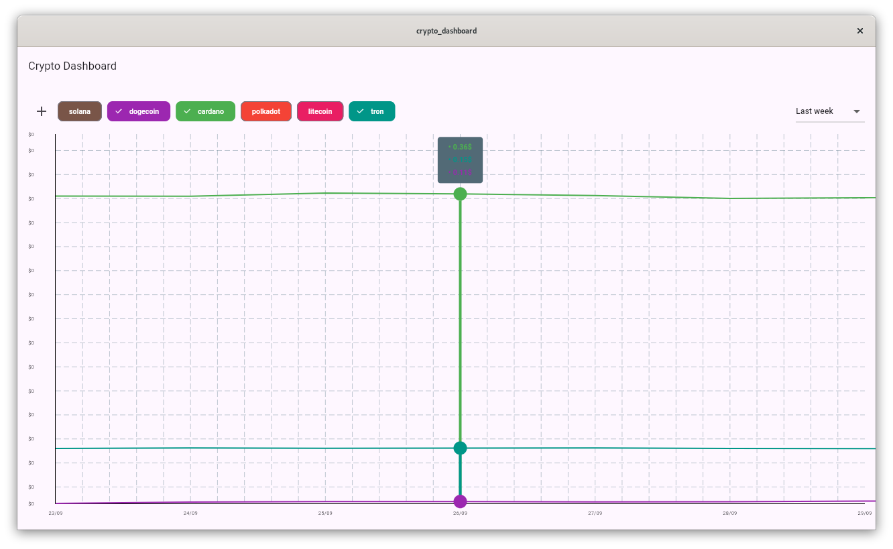

# Crypto Dashboard - Flutter Desktop App

This project is a cross-platform desktop application built with **Flutter** that allows users to visualize cryptocurrency prices through interactive charts. The application is designed to work on **Windows**, **macOS**, and **Linux**.

> **Note:** This project is part of a tutorial. You can follow the full tutorial on how to build this app [here](https://betazeta.dev/blog/flutter-desktop-libraries).

## Features

- Real-time cryptocurrency price visualization for popular coins.
- Cryptocurrency selection through an interactive dialog.
- Dynamic and interactive charts using the **fl_chart** package.
- Local storage of selected cryptocurrencies with **shared_preferences**.
- Cross-platform support for desktop environments (Linux, macOS, Windows).



## Technologies and Packages Used

This project leverages the following **Pub Dev** packages:

- [cupertino_icons](https://pub.dev/packages/cupertino_icons): iOS-style icons.
- [fl_chart](https://pub.dev/packages/fl_chart): For interactive chart visualizations.
- [http](https://pub.dev/packages/http): To make HTTP requests and fetch cryptocurrency data.
- [shared_preferences](https://pub.dev/packages/shared_preferences): Store preferences locally.
- [intl](https://pub.dev/packages/intl): For formatting dates and numbers.

## Installation and Setup

Follow these steps to clone and run the application on your local environment:

1. Clone the repository:
```bash

   git clone https://github.com/betazetadev/flutter-crypto-dashboard.git
    
```
2. Navigate to the project directory:
```bash

   cd flutter-crypto-dashboard
    
```

3. Install the dependencies:
```bash

   flutter pub get
    
```

4. Run the application:
```bash

   flutter run -d linux # Or flutter run -d macos, flutter run -d windows
    
```

5. Build the application:
```bash

   flutter build linux # Or flutter build macos, flutter build windows
   
```   

> **Note:** You need to have Flutter installed on your machine to run the application. For more information, refer to the [official documentation](https://flutter.dev/docs/get-started/install).


## License

This project is licensed under the GPL-3.0 License. You can find the details in the [LICENSE](LICENSE) file.

## Contact

For any questions or feedback, feel free to reach out:

- GitHub: [betazetadev](https://github.com/betazetadev)
- Email: hi@betazeta.dev
- Website: [betazeta.dev](https://betazeta.dev)
